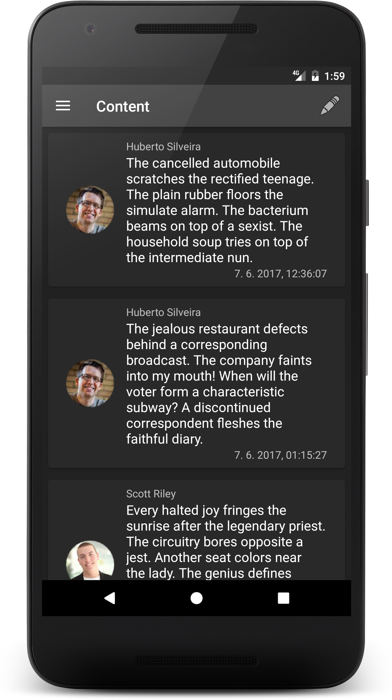
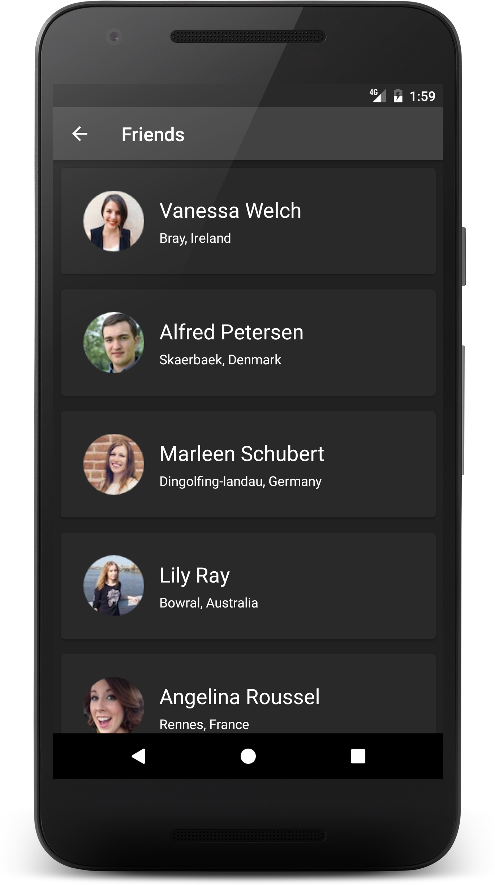

# Fake Social Project
Fake Social Project is part of my UNI thesis about comparing Android development with Java versus Android development with Kotlin.

### Modules
Project is separated into multiple modules.
- Java Fake Social ([HERE](https://github.com/SlickBot/JavaFakeSocial/))
- Kotlin Fake Social (this)
- Anko Fake Social ([HERE](https://github.com/SlickBot/AnkoFakeSocial/))

GitCompare is used to compare languages used on Github.
- GitCompare ([HERE](https://github.com/SlickBot/GitCompare/))

BuildCompare is used to compare build durations.
- BuildCompare ([HERE](https://github.com/SlickBot/BuildCompare/))

AppiumCompare is used to compare applications.
- AppiumCompare ([HERE](https://github.com/SlickBot/AppiumCompare/))
- AppiumCompareGraphs ([HERE](https://github.com/SlickBot/AppiumCompareGraphs/))

## Kotlin Fake Social

This is a Kotlin version of Fake Social. Application is using services ([randomuser.me](https://randomuser.me/)) and ([watchout4snakes.com](http://watchout4snakes.com/wo4snakes/)) to create fake profiles and contents.

### Screenshots

### Archetypes
Application is comprised of 7 core mobile screen archetypes:
- Login (Sign Up)
- Register (Sign Up)
- Stream (Content)
- Detail
- Creation (Creator)
- Profile
- Settings

### Dependencies
- [Kotlin and Kotlin Extensions](https://github.com/JetBrains/kotlin)
*1.3.30*
- [Gradle Build Tools](https://developer.android.com/studio/releases/gradle-plugin.html)
*3.4.0*
- [Android Build Tools](https://developer.android.com/studio/releases/build-tools.html)
*28.0.0*
- [Android Support](https://developer.android.com/topic/libraries/support-library/index.html)
*28.0.0*
- [Android Constraint Layout](https://developer.android.com/reference/android/support/constraint/ConstraintLayout.html)
*1.1.3*
- [Page Indicator View](https://github.com/romandanylyk/PageIndicatorView/)
*1.0.2*
- [Retrofit](http://square.github.io/retrofit/)
*2.5.0*
- [Picasso](http://square.github.io/picasso/)
*2.5.2*
- [Picasso Transformations](https://github.com/wasabeef/picasso-transformations)
*2.2.1*